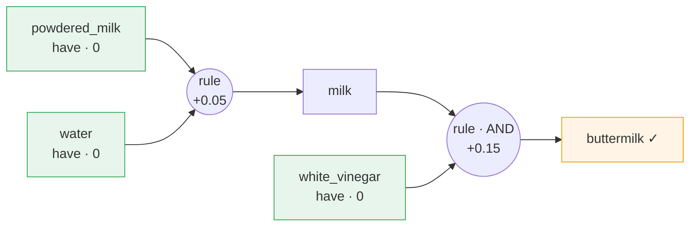

# 🥛 PantryPath

> *A tiny, explainable, offline engine that turns "I'm out of X" into the cheapest
> substitution chain — by modeling cooking substitutions as a **shortest-hyperpath** problem.
> No ML, no API.*

[](https://github.com/HarryXin0919/pantrypath/actions/workflows/ci.yml)
[](https://www.python.org/)
[](LICENSE)


Out of one ingredient? Don't ditch the dish. PantryPath models ingredient
substitution as a **shortest-path / shortest-hyperpath** problem and, given what
you **already have**, returns the highest-fidelity (least-flavor-loss) substitution
chain.

```
No buttermilk?  →  milk + vinegar   (85% fidelity)
```

## Why it's different

Most similar tools answer "what can I cook with what I have" (recipe search), or
call Spoonacular for a single layer of substitutes. Academic work (GISMo,
FlavorGraph, FoodKG) does use graphs — but via **ML embeddings / GNNs**. PantryPath
is different:

- 🧮 **Classic algorithm** — reduced to weighted shortest path / **directed-hypergraph
  shortest hyperpath**, solved with Dijkstra. Clean, provable, unit-tested.
- 🧪 **Compound substitution is the core** — buttermilk = milk **AND** vinegar. A plain
  graph can't express "you need both"; an **AND/OR hypergraph** can.
- 🎒 **Pantry-aware** — multi-source search from the ingredients you already have; stop on hit.
- 🔗 **Multi-hop chains** — powdered milk + water → milk → (+ vinegar) → buttermilk,
  accumulating flavor loss hop by hop.
- 🔍 **Fully explainable + offline** — outputs a substitution tree with a per-step cost;
  no network, no API, no trained model.
- 🥗 **Dietary tags** — require `vegan` / `gluten_free` and substitutions that break the
  tag are excluded automatically.

> 中文用户：核心思想与本说明一致 —— 把"缺料救场"建模成超图最短路径，给出还原度最高的替代链。
> 完整中英对照的设计文档见 [`docs/DESIGN.md`](./docs/DESIGN.md)。

## Quickstart

```bash
# install from source (not yet published to PyPI)
git clone https://github.com/HarryXin0919/pantrypath.git
cd pantrypath
pip install -e .        # gives you the `pantrypath` command; add .[dev] for tests, .[web] for the UI

# the signature example
python -m pantrypath.cli --need buttermilk --have milk,white_vinegar,sugar,egg
# or, after install:
pantrypath --need buttermilk --have milk,white_vinegar,sugar,egg
```

Output (the CLI prints a bilingual substitution tree):

```
🍳 目标食材 / target: buttermilk
   总还原成本 / total cost: 0.15   ≈ fidelity 85%
   实际使用 / uses: milk, white_vinegar
替代方案 / plan:
└─ buttermilk  ⇐ milk + white_vinegar  (cost 0.15)
         · 1 cup milk + 1 tbsp white vinegar, rest 10 min
   ├─ milk  ✅ have
   └─ white_vinegar  ✅ have
```

More usage:

```bash
# multi-hop: powdered milk + water → milk → buttermilk
python -m pantrypath.cli --need buttermilk --have powdered_milk,water,white_vinegar
# vegan egg
python -m pantrypath.cli --need egg --have flaxseed,water --require vegan
# several missing ingredients at once
python -m pantrypath.cli --need cake_flour,buttermilk --have all_purpose_flour,cornstarch,milk,lemon_juice
# Top-k: the cheapest plan plus runners-up, side by side
python -m pantrypath.cli --need buttermilk --have milk,white_vinegar,lemon_juice,plain_yogurt,water --top-k 3
```

With `--top-k 3` you get several alternatives ranked by fidelity:

```
🍳 buttermilk — 3 alternatives (ranked by fidelity)
[best ] cost 0.15  ≈ 85%  · milk, white_vinegar
[alt 2] cost 0.15  ≈ 85%  · milk, lemon_juice
[alt 3] cost 0.20  ≈ 80%  · plain_yogurt, water
```

> Top-k semantics: it keeps the **top-k rules** that produce the target (each rule's
> components are filled by their own cheapest sub-solution) for an "A / B / C"
> comparison. It is **not** a full k-shortest-hyperpath enumeration (which would also
> vary the sub-solutions) — that is future work, and the README states this honestly.

### 📋 Recipe-block parsing

Paste a whole ingredient list; PantryPath identifies ingredients line by line,
skips what you already have, then solves once **per missing ingredient** and
summarizes the cheapest chain for each. Recognition uses longest-match against the
knowledge base; quantities, units, and unknown lines are handled automatically.

```bash
# pass text directly
python -m pantrypath.cli recipe --have all_purpose_flour,milk,white_vinegar,sugar \
    --recipe-text "2 cups all-purpose flour
1 cup buttermilk
1/2 cup sugar
1 large egg
1 tsp vanilla extract"

# read from a file
python -m pantrypath.cli recipe --have milk,white_vinegar --recipe-file cake.txt
# read from a pipe
type cake.txt | python -m pantrypath.cli recipe --have milk,white_vinegar      # Windows
cat  cake.txt | python -m pantrypath.cli recipe --have milk,white_vinegar      # macOS/Linux
```

Output (excerpt):

```
📋 recipe parse
   recognized 4 ingredients (5 lines)
   ✅ have: all_purpose_flour, sugar
   ❓ unrecognized (not in KB, skipped): 1 tsp vanilla extract
   🔍 2 missing — 1 substitutable, 1 with no plan
============================================================

🍳 target: buttermilk
   total cost: 0.15   ≈ fidelity 85%
   ...
❌ no substitution found for "egg" (can't be reconstructed from what you have).
```

## How it works (in one sentence)

Each substitution option is a **rule node** wiring its component ingredients (AND)
to the target ingredient; pantry ingredients start at cost 0, and a **generalized
Dijkstra** fires a rule once all its components are settled (cost = rule cost + Σ
component costs), then backtracks into a substitution tree. Full formalization in
[`docs/DESIGN.md`](./docs/DESIGN.md).



*Compound (AND) + multi-hop in one picture: `powdered_milk + water → milk`, then
`milk + white_vinegar → buttermilk`, accumulating cost hop by hop. Output is bilingual
(中文 / English).*

## Knowledge base

Ships **310 ingredients · 225 targets · 449 substitution rules** (corrected against
culinary literature), covering dairy, flours & grains, sugars & syrups, fats,
acids/vinegars, leaveners, spices (including AND compound spice blends such as
`pumpkin_pie_spice = cinnamon + ginger + nutmeg + cloves`), thickeners, chocolate,
condiments, and more. Extend it by editing only
[`pantrypath/data/substitutions.yaml`](./pantrypath/data/substitutions.yaml) — no
code changes:

```yaml
substitutions:
  - target: buttermilk
    options:
      - {components: [milk, white_vinegar], cost: 0.15, note: "1 cup milk + 1 tbsp white vinegar, rest 10 min"}
```

## Tests

```bash
pytest -q     # 51 passed
```

## Design & related work

Algorithm formalization, the cost model, design trade-offs, and an honest
comparison with similar projects (GISMo / FlavorGraph / FoodKG) are in
**[`docs/DESIGN.md`](./docs/DESIGN.md)**. To contribute substitution rules or code,
see **[`CONTRIBUTING.md`](./CONTRIBUTING.md)**.

## License

MIT — see [LICENSE](./LICENSE).
